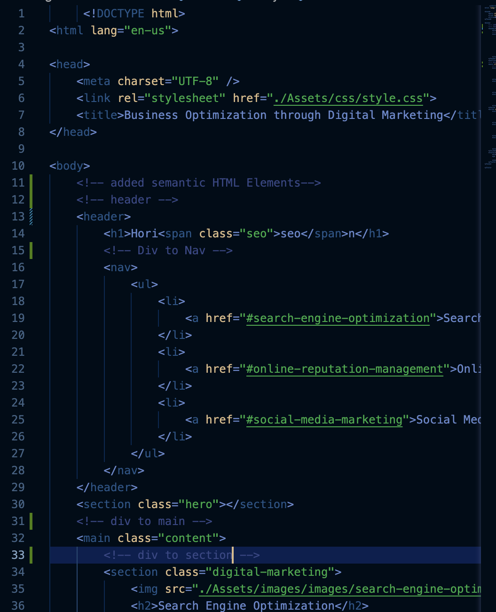
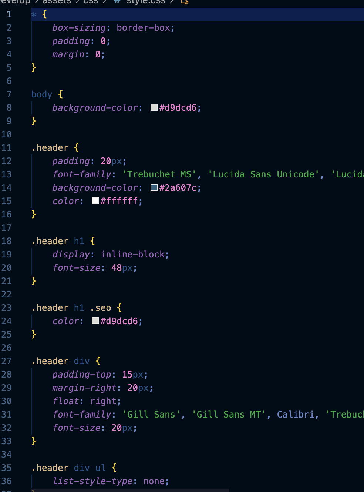
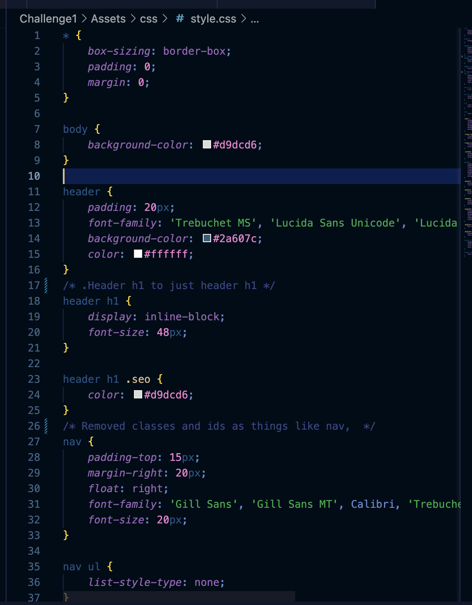
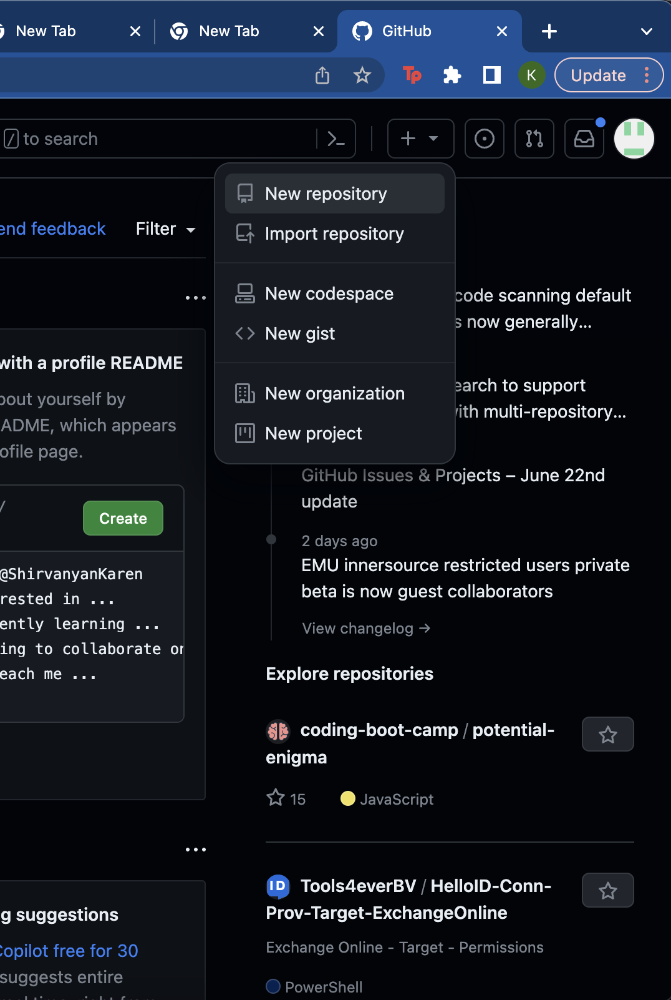
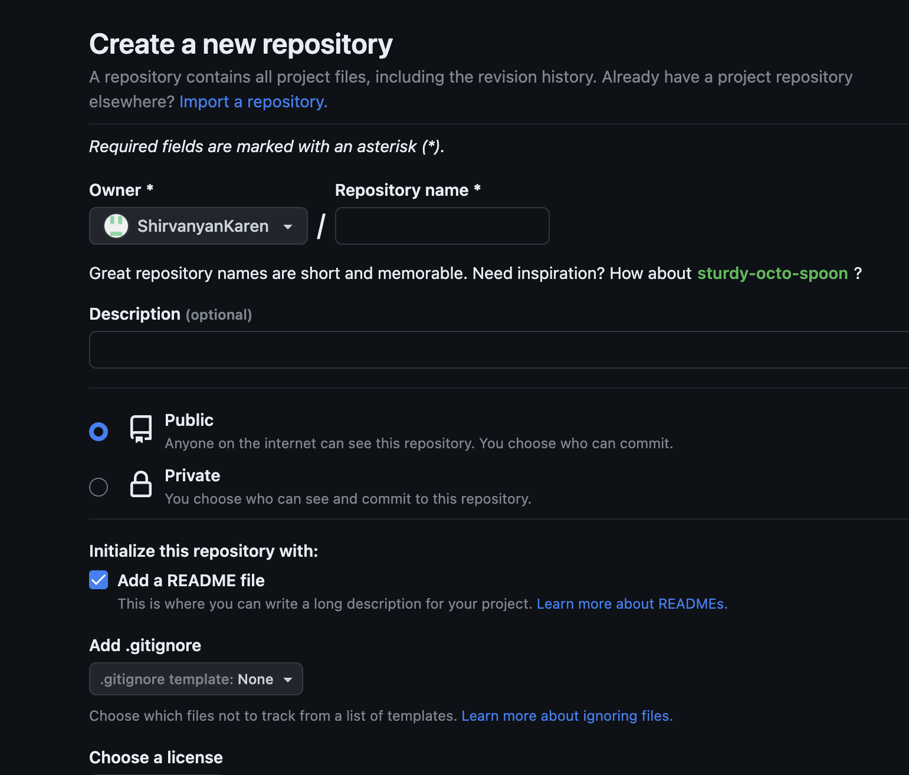
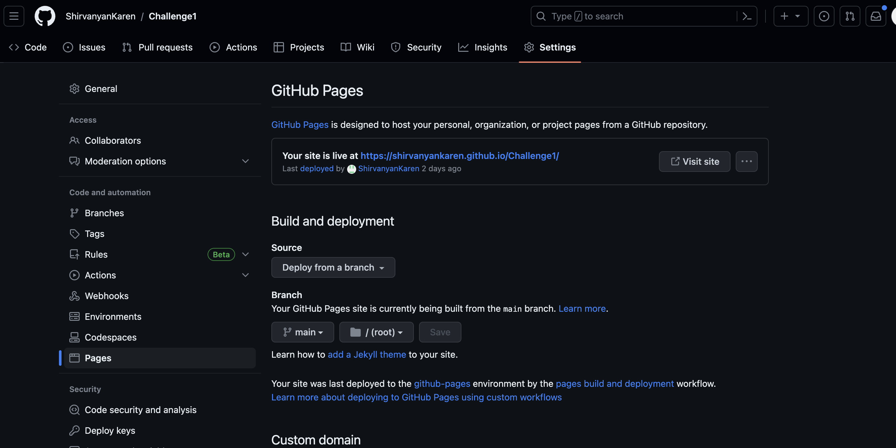

# Challenge 1 Horiseon On-the-job ticket

## Technology Used, Deployment, and Repository

| Technology Used         | Resource URL           | 
| ------------- |:-------------:| 
| HTML    | [https://developer.mozilla.org/en-US/docs/Web/HTML](https://developer.mozilla.org/en-US/docs/Web/HTML) | 
| CSS     | [https://developer.mozilla.org/en-US/docs/Web/CSS](https://developer.mozilla.org/en-US/docs/Web/CSS)      |   
| Git | [https://git-scm.com/](https://git-scm.com/)     | 
| Deployed Site | [https://shirvanyankaren.github.io/Challenge1/](https://shirvanyankaren.github.io/Challenge1/)     | 
| My Github Repository | [https://github.com/ShirvanyanKaren/Challenge1](https://github.com/ShirvanyanKaren/Challenge1/)     | 

## Desription 

The intent of this project was to refactor code to make it more accesible and increase search engine optimization

Given the following Horiseon HTML and CSS templates, to optimize the search engine results for the website, we had to meet the following acceptance criteria:

GIVEN a webpage meets accessibility standards
WHEN I view the source code
THEN I find semantic HTML elements
WHEN I view the structure of the HTML elements
THEN I find that the elements follow a logical structure independent of styling and positioning
WHEN I view the image elements
THEN I find accessible alt attributes
WHEN I view the heading attributes
THEN they fall in sequential order
WHEN I view the title element
THEN I find a concise, descriptive title

## Table of Contents

* [Code Refactory](#code-refactory)
* [Usage](#usage)
* [Learning Points](#learning-points)
* [Credits](#credits)
* [License](#license)

## Code Refactory

To meet the acceptance criteria, several components of the HTML and CSS files had to be modified. First, I began with structuring the code to include semantic HTML elements.

The source HTML code lacked semantic elements and used 
's instead. To mitigate this, I included HTML semantic elements such as header, nav, section, etc.

!

The corresponding css code also required updating as it included titles like .header for classes/ IDs that could otherwise be attributed to HTML elements.

Originals css:

Which was changed to this:

Along with these changes, modifications were also made to heading elements, falling in sequential order with h1 being the most important, as well as the title of the website to "Business Optimization through Digital Marketing" seen in the updated HTML picture. 

## Usage
The usage of the project was complimented with github deployment and my online github repository.

The repository was created on my github account through adding repository on the top right then including a name and READ.me file. 

Creating repository:

Setting repository name and adding REAM.me file

After setting creating the repository, the next step was to clone the file using the github SSH key onto my terminal and adding files like index.html, style.css, and Assets/omages.

To deploly the site, I had to access the repository on github and go to settings on the top right then pages on the left directory.

Through this menu, I selected deploy from a branch for the source and main>root for the branch. 

## Learning Points

The project taught me a lot about HTML and CSS configurations. Practices such as including semantic HTML elements and using DRY code (Don't Repeat Yourself) simplifies the content and makes it more accesible to search engines. 
I learned that creating classes and ids for already established HTML semantic elements is unnecessary for CSS as the element name can be selected within CSS. I also learned that CSS selectors can be applied to mutliple HTML elements when added to their parent element. This saved a lot of code and simplified the contents of both the HTML and CSS files. 

## Credits

Ramon Sanchez from the Central Tutor Support assisted me in simplifying a lot of the CSS code. 

I also referred to the following:
[W3 Schools HTML Elements Guide](https://www.w3schools.com/html/html_elements.asp)
[W3 Schools HTML Semantic Elements Guide](https://www.w3schools.com/html/html5_semantic_elements.asp)
[W3 Schools CSS Selectors Guide](https://www.w3schools.com/cssref/css_selectors.php)

## License 

MIT licensing with permisions such as commercial use, modification, distribution and private use. Limitations include liability and warranty.

